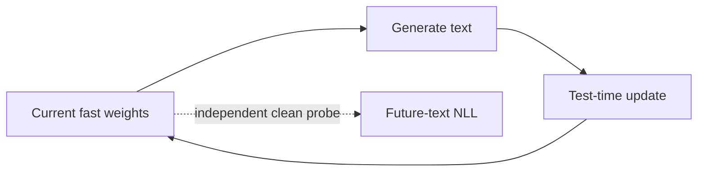

# TTT Ouroboros

**Self-generated feedback in persistent test-time training.**

Official reproduction code for **“Self-Generated Feedback Destabilizes
Test-Time Training: A Causal Decomposition of Long-Horizon Adaptation.”**

`Ouroboros` refers to the closed loop studied in the paper: an adapting model
generates text, learns from that text, and thereby changes the data it will
generate and learn from next.



## What this repository shows

- **Closed-loop self-writing can cause severe long-horizon damage.** On the
  audited 125M canonical suite, Closed Loop adds `3.0097` nats of first-to-last
  clean-text harm over Writes Off.
- **Generated text alone is insufficient.** Fixed Generation breaks the causal
  path from the learner state to future generated data and reduces the same gap
  to `0.0516` nats.
- **The failure depends on exposure.** Frequent external text interrupts the
  loop, while long generated bursts remain hazardous.
- **The updates are state dependent and heavy tailed.** A small number of
  trajectories enter high-cost states; identical updates can have different
  effects at different receiver states.
- **Settlement tests transfer before persistent commitment.** The release
  includes language and WebShop implementations together with their controls.

The repository contains the native TTT-E2E runtime, controlled causal
interventions, versioned experiment manifests, paired analysis, audited
per-book data, and the scripts used to build the paper figures.

## What is code, data, and evidence

The repository keeps three layers separate:

1. **Runners and manifests** define the experiment and write sample-level JSON.
2. **Analysis scripts** consume those JSONs and define the statistical unit.
3. **Frozen artifact bundles** contain large checkpoints, recorded trajectories,
   and raw result JSONs. They are distributed separately and identified by
   SHA256; they are not silently reconstructed from manuscript tables.

This distinction matters for auditability. A runnable script establishes that
an experiment can be repeated; only its original raw JSON establishes the
sample count, pairing, overlap checks, and confidence interval reported in the
paper. See [`docs/ARTIFACTS.md`](docs/ARTIFACTS.md) for the exact availability
of each result family.

## Quick start

The reference environment uses Python 3.11 and CUDA 12.4. PyTorch 2.5–2.9 is
supported.

```bash
git clone https://github.com/lingjivoo/ttt-ouroboros.git
cd ttt-ouroboros
conda env create -f environment.yml
conda activate ttt-ouroboros
pip install -e .
```

Configure the external artifacts:

```bash
cp env.sh.example env.sh
# Set TTT_DATA, TTT_CKPT and TTT_OUT to absolute paths.
source env.sh
```

Validate the installation and run a one-book integration test:

```bash
make check
python scripts/selfcheck.py --profile language --full
python scripts/run_paper_suite.py \
  --suite configs/suites/main_125m.yaml \
  --smoke
```

The smoke test executes checkpoint loading, real-text prefill, autoregressive
generation, fast-weight updates, branch-only probes and signed JSON output. It
is an execution check rather than a paper result. See
[`docs/VALIDATION.md`](docs/VALIDATION.md) for the completed release validation.

## Data and checkpoints

Model weights and corpora are external because of their size and upstream
licenses. The canonical 125M experiment expects:

```text
$TTT_DATA/pg19/val.npy
$TTT_CKPT/125m-ext32k.pt
```

Optional scale suites expect:

```text
$TTT_CKPT/760m-ext32k.pt
$TTT_CKPT/3b_128k_pt.pt
```

`val.npy` is the tokenized PG-19 validation stream with BOS-delimited book
boundaries. Artifact preparation, hashes and the optional WebShop layout are
documented in [`docs/DATA.md`](docs/DATA.md).

## Reproduce the canonical experiment

Run Writes Off, Closed Loop and Fixed Generation at 125M:

```bash
python scripts/run_paper_suite.py \
  --suite configs/suites/main_125m.yaml
```

The canonical protocol uses:

- logical width 8 over physical book rows 0–7;
- reported books 2–7;
- seeds 42, 1, 7, 2 and 3;
- 128 chunks of 1,024 tokens;
- temperature 1 and top-p 0.95;
- eight real-text prefill writes;
- 16 branch-only clean probes.

The prefill-end baseline and first scheduled probe score the same read-only
passage. This isolates state change from probe-text change and preserves the
audited 25,601-token book-selection threshold.

Aggregate paired first-to-last changes and bootstrap books:

```bash
python analysis/summarize_canonical.py \
  --closed "$TTT_OUT/canonical/closed.json" \
  --writes-off "$TTT_OUT/canonical/writes_off.json" \
  --fixed "$TTT_OUT/canonical/fixed_generation.json" \
  --out "$TTT_OUT/canonical/SUMMARY.md"
```

The summarizer rejects results with mismatched checkpoints, corpus hashes,
books, seeds, width or probe schedule.

Run the same protocol at larger scales:

```bash
python scripts/run_paper_suite.py --suite configs/suites/main_760m.yaml
python scripts/run_paper_suite.py --suite configs/suites/main_3b.yaml
```

The 3B manifests preserve a true logical width of 8 and require a high-memory
GPU. Inspect any suite without launching work using `--dry-run`.

## Paper result map

| Result family | Primary runner | Released material |
|---|---|---|
| 125M/760M/3B Closed Loop vs Writes Off | `scripts/horizon.py` | runner + manifests |
| Fixed Generation and 125M replay | `scripts/horizon.py`, `scripts/mechanism_pilot.py` | runner + manifests |
| Disjoint-source 3B replay | `scripts/reviewer_3b_replay.py` | exact runner; recorded trajectories external |
| Exposure-density boundary | `scripts/exposure_density_sweep.py` | runner + analysis |
| Single-update transfer | `scripts/preq_obs.py` | runner |
| Gradient direction/correlation | `scripts/p1_direction_prediction.py` | exact runner + cluster bootstrap |
| State-dependent heavy tail | `scripts/acceptance_heavy_tail.py` | runner + figure input |
| aTTT and matched write-dose controls | `scripts/attt_closed_loop.py` | runner |
| Update-strength frontier | `scripts/update_strength_sweep.py` | runner + analysis |
| Anchor causal decomposition | `scripts/anchor_causal.py` | runner |
| Language Settlement | `scripts/deferred.py`, `scripts/settlement_mixed.py` | runner + analysis |
| WebShop causal comparison | `scripts/ws_arms.py` | runner + paired analysis |
| Qwen3-4B real-text utility | `scripts/qwen_reviewer_p0c.py` | runner |

[`docs/PAPER_REPRODUCTION.md`](docs/PAPER_REPRODUCTION.md) maps individual
tables and figures to their exact code and statistical unit. Canonical,
exposure-density and Settlement endpoints belong to separate protocol families
and must not be pooled merely because they are all measured in nats.

## WebShop

Install the optional agent dependencies and configure the upstream WebShop
checkout and deterministic catalogue:

```bash
pip install -e '.[language,agents,dev]'
python scripts/ws_build_catalogue.py --help
```

The four paper policies are `none` (Writes Off), `uniform` (Closed Loop),
`fixed` (Fixed Generation) and `settlement`:

```bash
python scripts/ws_arms.py --policy none       --stream-seed 0 --out "$TTT_OUT/webshop/off_s0.json"
python scripts/ws_arms.py --policy uniform    --stream-seed 0 --out "$TTT_OUT/webshop/closed_s0.json"
python scripts/ws_arms.py --policy fixed      --stream-seed 0 --out "$TTT_OUT/webshop/fixed_s0.json"
python scripts/ws_arms.py --policy settlement --stream-seed 0 --out "$TTT_OUT/webshop/settlement_s0.json"
```

Repeat stream seeds 0–4. Each arm processes 900 training episodes and the same
150 held-out goals. Settlement evaluates each temporary 25-episode candidate
on 10 disjoint validation goals before commitment.

New result JSONs include the exact goal IDs, split identity and goal-set hashes.
The runner aborts if candidate and committed states are evaluated on different
validation goals. Analyze five-seed outputs with a paired seed/goal bootstrap:

```bash
python analysis/bootstrap_webshop.py \
  --arm "$TTT_OUT/webshop/settlement" \
  --control "$TTT_OUT/webshop/writes_off_s0.json" \
  --pattern 'settlement_s*.json' \
  --out "$TTT_OUT/webshop/settlement_bootstrap.json"
```

The original formal WebShop JSONs predate inline goal IDs. Their separately
released goal manifest deterministically reconstructs the split and confirms
zero overlap among the 900-task training streams, 10 validation goals and 150
final-evaluation goals.

## Replay and gradient-direction audits

The formal 3B replay runner records a generated source once, replays identical
tokens into disjoint receiver books, and compares read-only with read+write:

```bash
python scripts/reviewer_3b_replay.py --help
```

Every output contains source and receiver byte bounds, received-token hashes,
checkpoint/data/code hashes, per-book NLL curves and the condition name. The
recording and result JSONs live in the external artifact bundle.

The gradient-direction experiment measures whether the candidate update's
alignment with a clean-text gradient predicts realized transfer damage:

```bash
python scripts/p1_direction_prediction.py --help
python analysis/bootstrap_gradient_correlation.py \
  --input "$TTT_OUT/gradient_direction/raw" \
  --split confirmation --history closed \
  --out "$TTT_OUT/gradient_direction/confirmation_closed_bootstrap.json"
```

Its bootstrap resamples books and seeds as clusters while retaining all stream
positions. Do not substitute update norm or one-write NLL transfer for gradient
cosine; they answer different questions.

## Regenerate the figures

```bash
make figures
```

The canonical trajectory is rebuilt from committed audited per-book data in
`data/unified_perbook_data.json`. Figure sources explicitly mark panels whose
original raw launcher was unavailable and therefore use a frozen audited
aggregate.

## Environment options

For an existing CUDA-compatible PyTorch installation:

```bash
pip install -e '.[language,dev]'
```

For Docker:

```bash
docker build -t ttt-ouroboros .
docker run --rm --gpus all \
  -v /absolute/data:/data:ro \
  -v /absolute/checkpoints:/checkpoints:ro \
  -v "$PWD/results:/workspace/ttt-ouroboros/results" \
  -e TTT_DATA=/data -e TTT_CKPT=/checkpoints \
  ttt-ouroboros --suite configs/suites/main_125m.yaml --smoke
```

## Repository layout

```text
ttt_pt/       TTT model, fast-weight state, streaming decoder and update code
configs/      versioned experiment manifests and ordered suites
scripts/      experiment runners and release utilities
analysis/     paired aggregation and book-bootstrap summaries
figures/      submitted figure generators
data/         audited aggregate inputs
validation/   numerical and state-restoration checks
tests/        mechanics, manifest and release-workflow tests
docs/         protocol, installation and result-to-code documentation
```

## Reproducibility guarantees

- Checkpoint, corpus, book selection, seed set, decoder and probe schedule are
  included in result identity.
- Probes snapshot and restore all carried state; evaluation text is read-only.
- Books or held-out tasks are independent units; seeds are averaged within
  them before uncertainty is computed.
- Interrupted JSON outputs resume only when their signed configuration matches.
- Writes are atomic, preventing a preempted job from corrupting completed seeds.
- `SOURCE_MANIFEST.json` records SHA256 and byte size for every released file.

Run `make check` and `python scripts/source_manifest.py --check` before creating
a release.

## Scope

This release is deliberately paper focused. ALFWorld, ScienceWorld, retrieval
and other exploratory follow-ups that do not appear in the paper are excluded.
The original Qwen3-4B long-horizon grid launcher and source-label-corruption
grid launcher were unavailable in the recovered experiment snapshot; their
audited aggregates and plotting paths are retained and explicitly identified.
The original 3B replay result JSONs were also not recovered; the exact runner
and recorded source trajectories survive, so this cell is rerunnable but its
previous point estimates are not independently auditable from this source tree.

## Citation and license

Citation metadata is provided in [`CITATION.cff`](CITATION.cff). Code is
released under the MIT License. Checkpoints and datasets retain their upstream
licenses.
